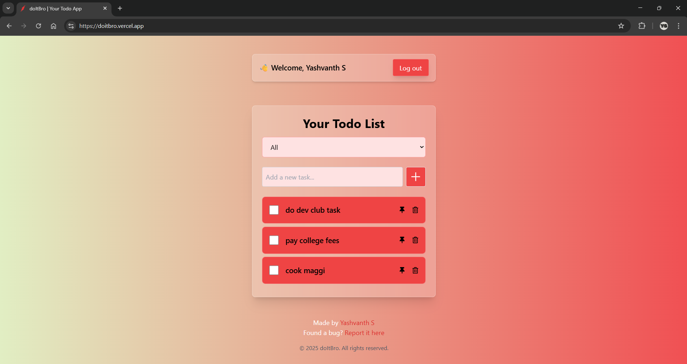

# 📝 Todo List App with Google Auth 🚀


A clean, modern, and fully-featured **Todo App** built with **React** and **Firebase**.  
Features real-time updates, filtering, pinning, and Google authentication — all styled beautifully with TailwindCSS.

---

## 🔥 Features

✅ Google Sign-In Authentication  
✅ Add, Delete, Mark Complete/Incomplete  
✅ Pin Todos to Top  
✅ Filter by Completed / Incomplete / All  
✅ Sort by Date (Newest / Oldest)  
✅ Real-time Sync via Firebase Firestore  
✅ Fully Responsive UI  
✅ Data Privacy – Each user sees only their own tasks

---

## 🚀 Tech Stack

| Technology    | Badge                                                                                                                  |
| ------------- | ---------------------------------------------------------------------------------------------------------------------- |
| Frontend      |                      |
| Backend       |             |
| Styling       |  |
| Auth Provider |            |
| Tooling       |                         |

---

## ⚙️ Setup Instructions

Follow these steps to run this project locally:

### 📦 1. Clone the Repository

```bash
git clone https://github.com/YOUR_USERNAME/todo-firebase-react.git
cd todo-firebase-react
```

```bash
npm install
```

---

🔑 3. Firebase Setup

-Go to Firebase Console
-Create a new project.
-Enable Firestore Database and Google Sign-In in Authentication > Sign-in method.
-Add a web app and copy the Firebase config.

Create a file named firebase.js inside the src directory:

```bash
// src/firebase.js
import { initializeApp } from 'firebase/app';
import { getFirestore } from 'firebase/firestore';
import { getAuth, GoogleAuthProvider } from 'firebase/auth';

const firebaseConfig = {
  apiKey: "YOUR_API_KEY",
  authDomain: "YOUR_AUTH_DOMAIN",
  projectId: "YOUR_PROJECT_ID",
  storageBucket: "YOUR_BUCKET",
  messagingSenderId: "YOUR_SENDER_ID",
  appId: "YOUR_APP_ID"
};

const app = initializeApp(firebaseConfig);
export const db = getFirestore(app);
export const auth = getAuth(app);
export const provider = new GoogleAuthProvider();
```

---

🔒 4. Firestore Rules
Protect user data! Go to Firestore → Rules and replace with:

```bash
rules_version = '2';
service cloud.firestore {
  match /databases/{database}/documents {
    match /todos/{document} {
      allow read, write: if request.auth != null && request.auth.uid == resource.data.uid;
    }
  }
}
```

---

▶️ 5. Run the App

```bash
npm run dev
```

The app will run locally at:  
👉 http://localhost:5173

---

Screenshot



---

🐞 Found a Bug or Issue?  
Please report it here: GitHub Issues  
or fill this Google Form (replace with your actual link)

🙌 Your feedback helps improve the app!

👨‍💻 Author  
Yashvanth S  
📎 [LinkedIn](https://www.linkedin.com/in/yashvanths/)  
🔒 Gmail is kept private. Please contact through LinkedIn or the feedback form.

---

🌟 Show Some Love  
If you found this app useful:  
-⭐ Star the repo  
-📤 Share with friends  
-💬 Feel free to contribute

---

Made with 💖 by Yashvanth S
